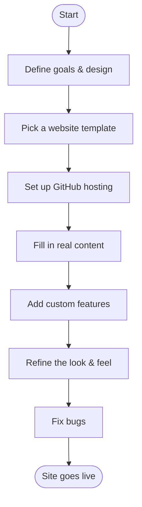

This site was built in a single session using [Claude Code](https://claude.com/claude-code), an AI coding assistant. I described what I wanted, and we built it together step by step. This post is a record of how that went.

---

## The Steps We Followed

---

## Key Choices

**Website template:** I used [al-folio](https://github.com/alshedivat/al-folio), a free template designed for academic researchers. It came with a publications page, a blog, and a clean layout out of the box.

**Hosting:** The site is hosted on GitHub Pages — free, reliable, and automatically rebuilds every time I save a change. No server to manage.

**Research graph:** The interactive graph on the Research page was a custom addition. It shows my research topics and papers as connected dots. Clicking a topic scrolls to the paper list. Hovering shows a description.

**CV section:** Rather than designing an experience timeline from scratch, I structured my CV as a simple data file (`cv.yml`). The site reads it and renders the timeline automatically.

**Color scheme:** The default template used a bright magenta. I replaced it with indigo — more professional, easier on the eyes.

---

## What Went Wrong (and How We Fixed It)

**The site wouldn't deploy.** GitHub disables automatic deployment on forked repositories by default. We had to go into Settings and turn it on manually.

**The site deployed but looked broken.** GitHub was trying to rebuild an already-built site, which failed on custom features. The fix was adding a hidden file called `.nojekyll` that tells GitHub to serve the files as-is.

**Dark mode text was invisible.** Some elements had hard-coded white backgrounds that ignored the dark theme. Each one needed an explicit fix.

**Changes weren't showing up.** Early on, I edited files but forgot to save them to GitHub. Nothing deploys until you commit and push.

---

## Lessons Learned

- **Describe what you want in plain terms.** The AI handles the technical translation. You don't need to know the code.
- **Review on mobile early.** Several design choices that looked fine on desktop looked cramped or cluttered on a phone.
- **One change at a time.** When multiple things changed at once and something broke, it was hard to tell what caused it.
- **Keep data in one place.** I maintain paper information in two files (one for the publications page, one for the graph). Keeping them in sync requires discipline.

---

## Tools That Helped

| Tool | Purpose |
|---|---|
| [Claude Code](https://claude.com/claude-code) | AI coding assistant — wrote and debugged code from plain instructions |
| [al-folio](https://github.com/alshedivat/al-folio) | Website template built for academics |
| [GitHub Pages](https://pages.github.com) | Free hosting with automatic deployment |
| [D3.js](https://d3js.org) | Library used to draw the interactive research graph |

---

*If you are an academic thinking about building your own site, the barrier is lower than it looks — especially with AI assistance.*
